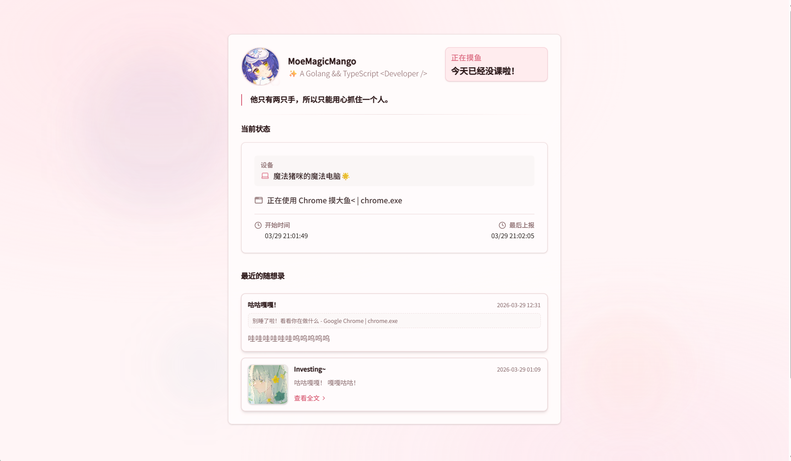

> 不是被闹钟惊醒，而是温柔地、自愿地，与世界重新相遇。

<p align="center">
<h2 align="center">Waken Wa💫</h2>
  
  
  <p align="center">
    
    
    
  </p>
</p>

✨ 一日一记，一醒一悟。

> 另一种形式的日常生活观察窗~

> 晨光里睁眼是醒，  
> 深夜写下"今天很好"也是醒。


> 项目灵感来源于 [Sleepy](https://github.com/sleepy-project/sleepy) 和 [Shiro](https://github.com/Innei/Shiro)

---

## 项目特点🌟

- 多平台 （Windows / MacOS / Android）自动上报，状态会自己同步，不用刻意去记

- 支持 Windows 下 SMTC 音乐上报支持，即意味着大部分平台（网易云需BetterNCM）都可以支持

- 支持自己定制样式，并且提供了默认十种配色方案和允许使用自己背景的方案，并且加入了 Skills 可以让AI帮你调色！

- 进阶大部分设置都允许 AI 使用工具帮你修改，可以体验一下哦w

- 支持一言哦，并且提供了很详细的配置

- 支持 ICS 课表 *（大部分课表产品都支持导出此格式哦），现在你朋友上课也可以看到了:)

- 支持 Steam 显示正在游玩的游戏

- 支持 随想录，可以将现在所发生的事情和状态同时记录上，Markdown兼容，使用 Lexical 作为富文本编辑器

- 支持 应用状态修改，你可以使用规则将你正在使用的应用修改显示标题，并且我们提供了使用应用导出功能，可以让AI快速写出你需要定制的规则

- 支持 白名单 / 黑名单 显示状态，你可以轻松过滤或者仅显示你想要的应用

- 支持 页面密码锁，同时可配置 Hcaptcha，如果你的想法不想让别人知道的话，也可以帮你保密哦

- 支持 Vercel ServerLess / Railway / Docker 部署，虽然说推荐自己的机子部署，但是你想的话我们也可以部署云平台上，减少配置麻烦

- 支持 API 调用，你可以将它放到任何的地方，只要使用我们提供的Agent文件即可让AI帮你做出想要的同步工具


---

## 技术栈

> ⚠️ **提示：该项目处于早期开发阶段，可能会有不可避免的 bug。**

- **Next.js** 16.2（App Router）
- **React** 19.2 / **React DOM** 19.2
- **TypeScript** ~5.9
- **Tailwind CSS** 4.x（`@tailwindcss/postcss`）
- **Drizzle ORM** + **Drizzle Kit**，数据库按环境使用 **SQLite**（better-sqlite3）或 **PostgreSQL**（pg）
- **Redis** 7.0
- **Radix UI**、**Zod**、**react-hook-form**、**jose**（JWT）、**bcryptjs**

---

## 快速开始

### 环境要求

- **本地开发：** Node.js 20+
- **包管理：** 仓库以 **pnpm** 为主（也可用 npm / yarn）
- **可选：** Docker（镜像基于 **Node.js 22**，见根目录 `Dockerfile`）

### 安装与运行

```bash
pnpm install
pnpm dev
```

在浏览器中打开 [http://localhost:3000](http://localhost:3000)。

> 如果需要使用，请配合 [Waken-Wa-Reporter](https://github.com/MoYoez/waken-wa-reporter)

### 环境变量

复制 [`.env.example`](.env.example) 为 `.env` / `.env.local` 并按需填写。常见项：

- **`DATABASE_URL`** — 默认 SQLite（如 `file:./drizzle/dev.db`）；生产可改为 `postgres://` / `postgresql://`
- **`JWT_SECRET`** — 管理会话签名；不设置则默认自动生成。Docker 下留空时会在数据卷中生成持久化密钥文件
- **`NEXT_PUBLIC_BASE_URL`** — 站点对外访问地址（反向代理或生产域名）
- **`STEAM_API_KEY`** — Steam Web API 可选；也可在管理后台「站点设置」中配置
- **`HCAPTCHA_*`** — 整站访问锁可选

头像、昵称、简介等通过 **`/admin` 站点设置**（或首次 setup）配置。

### 构建

```bash
pnpm build
pnpm start
```

---

## 部署

### 1. 本机部署

#### Docker（使用已打包的一键脚本）

需已安装 **Docker**（含 `docker compose`）。在终端执行：

```bash
curl -fsSL https://wakeme.lemonkoi.one | sh
```

脚本会拉取项目并以 Compose 构建、启动（默认 SQLite 数据卷等，详见仓库内 `docker-compose.yml`）。环境变量可参照 [`.env.example`](.env.example)，或在部署目录中编辑 `.env`。

#### 自编译（源码）

在已克隆的本仓库根目录执行（需 **Git**、**Docker**）：

```bash
chmod +x deploy-build-from-source.sh   # Unix 首次需要
./deploy-build-from-source.sh
# 或: bash deploy-build-from-source.sh
```

脚本会准备 `.env`（若无则从 `.env.example` 复制）、按需生成 `JWT_SECRET`，并执行 `docker compose up -d --build`。也可通过环境变量指定分支与目录，例如 `WAKEN_BRANCH`、`WAKEN_REPO_URL`、`WAKEN_DEPLOY_DIR`（见脚本内注释）。

若仅本地开发而非容器，见上文「快速开始」中的 `pnpm dev` / `pnpm build`。

### 三星手表健康数据

- 上传接口：`POST /api/health`（Bearer API Token）
- 展示接口：`GET /api/health?public=1`
- 首页展示：`三星手表健康摘要` 卡片
- 样例脚本：`pnpm health:upload:sample`

详细字段说明见 [`docs/samsung-health.md`](docs/samsung-health.md)。

#### 在 Windows 下 部署

你需要的:

- Docker Desktop 或者类 Docker (Podman Desktop) ，支持 Compose 即可

- Git (可选，不过推荐)

Clone 此项目，如果你没有用 Git ，可以使用 “下载Zip”的方式获取项目源代码

在项目中 使用 

> docker compose up -d

即可

如果你需要从源码编译，使用

> docker compose up -d -build

即可


---

### 2. Railway

[](https://railway.com/deploy/waken-wa)

> Railway 可能需要使用 Hobby 方案.


### 3.Vercel

> 需要使用 PostgresSQL (SupaBase / Neon) + Redis ，且开销较高 (SSE 长连接 / Realtime POST 多)

> 如需使用请考虑 非 Realtime 模式上传活动，并且在后台启用 Polling （轮询）


[](
https://vercel.com/new/clone?repository-url=https://github.com/MoYoez/waken-wa
)

> 第一次部署后不用担心报错，在项目的 "Integrations" 中 通过 "Marketplace"找到 **PostgreSQL** 和 **Redis** 供应商，Install 后 Connect 到此项目，Redeploy 即可。

> 如果你想用自己的供应商，请在 env 的 DATABASE_URL 中 写入地址即可，请注意 Vercel 这类 Serverless 平台的URL兼容性，以防止部署失败。

> 当然，不启用 Redis 是没有问题的，但有可能会出现数据上报传上去了，但是没有出现实时数据的情况/ 在Vercel上是默认开启的，如果没有会被回退到内存，但是受限于Serverless环境，数据可能会丢失


---

## License

本项目以 [**GNU Affero General Public License v3.0**](LICENSE)（AGPL-3.0）授权发布。完整条款见仓库根目录 [`LICENSE`](LICENSE)。

---